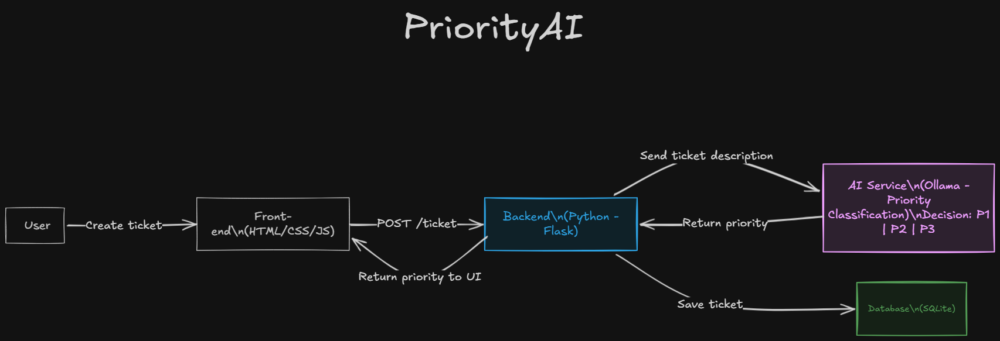
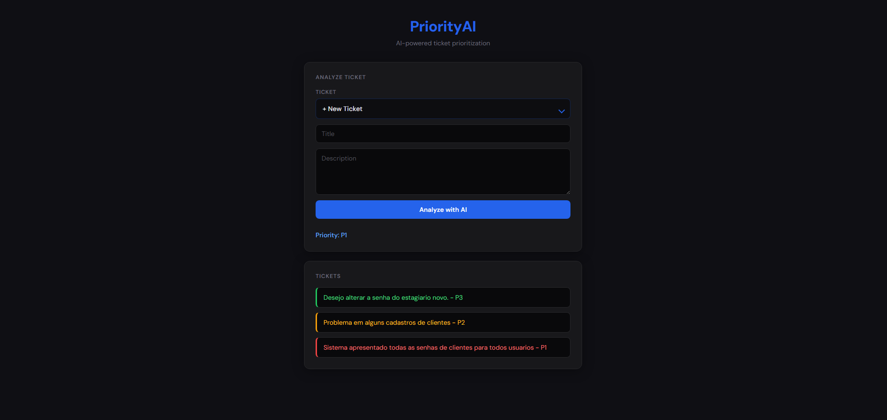

# PriorityAI

A web application that uses AI to automatically classify support tickets by priority level - **P1**, **P2**, or **P3** - based on their description.

---

## Overview

PriorityAI receives a ticket title and description, sends it to a local AI model (Ollama + Mistral), and returns a priority classification. All tickets are persisted in a local SQLite database and displayed in the interface in real time.

---

## Priority Levels

| Level | Criteria |
|-------|----------|
| 🔴 **P1** | System down; critical business impact; many users affected; security incidents (malware, ransomware, data breach, unauthorized access, virus, spyware); infrastructure failures |
| 🟡 **P2** | Partial issues; degraded performance; some users affected; potential security risks |
| 🟢 **P3** | Routine requests; password resets; user creation or updates; non-urgent tasks |

---

## Architecture



The request flow follows these steps:

1. User fills in the ticket form on the frontend
2. Frontend sends a `POST /ticket` to the Flask backend
3. Backend calls the AI service (Ollama running locally)
4. AI returns `P1`, `P2`, or `P3`
5. Backend saves the ticket to SQLite and returns the priority to the UI

---

## Tech Stack

| Layer | Technology |
|-------|------------|
| Frontend | HTML, CSS, JavaScript (vanilla) |
| Backend | Python + Flask |
| AI | Ollama (Mistral) |
| Database | SQLite |

---

## Project Structure

```
priority-ai/
├── main.py                       # Entry point
├── requirements.txt
├── app/
│   ├── routes/
│   │   └── ticket_routes.py      # API endpoints
│   ├── services/
│   │   └── ai_service.py         # Ollama integration
│   └── database/
│       └── db.py                 # SQLite operations
├── static/
│   ├── css/
│   │   └── style.css
│   └── js/
│       └── script.js
└── templates/
    └── index.html
```

---

## Prerequisites

- Python 3.10+
- [Ollama](https://ollama.com) installed and running locally
- Mistral model pulled via Ollama

---

## How to Run

**1. Clone the repository**

```bash
git clone https://github.com/your-username/priority-ai.git
cd priority-ai
```

**2. Create and activate a virtual environment**

```bash
python -m venv venv

# Windows
venv\Scripts\activate

# macOS / Linux
source venv/bin/activate
```

**3. Install dependencies**

```bash
pip install -r requirements.txt
```

**4. Start Ollama and pull the model**

```bash
ollama serve
ollama pull mistral
```

> Ollama must be running on `http://localhost:11434` before starting the app.

**5. Run the application**

```bash
python main.py
```

Open your browser at **http://localhost:5000**

---

## API Endpoints

| Method | Endpoint | Description |
|--------|----------|-------------|
| `GET` | `/` | Serves the frontend |
| `POST` | `/ticket` | Creates and classifies a new ticket via AI |
| `POST` | `/ticket/duplicate` | Saves an existing ticket without re-running AI |
| `GET` | `/tickets` | Returns all saved tickets |

**POST /ticket — request body**

```json
{
  "title": "Login page is down",
  "description": "Users cannot access the system since 8am. Complete outage."
}
```

**POST /ticket — response**

```json
{
  "priority": "P1"
}
```

**POST /ticket/duplicate — request body**

```json
{
  "title": "Login page is down",
  "description": "Users cannot access the system since 8am. Complete outage.",
  "priority": "P1"
}
```

---

## Screenshot



---

## License

MIT
